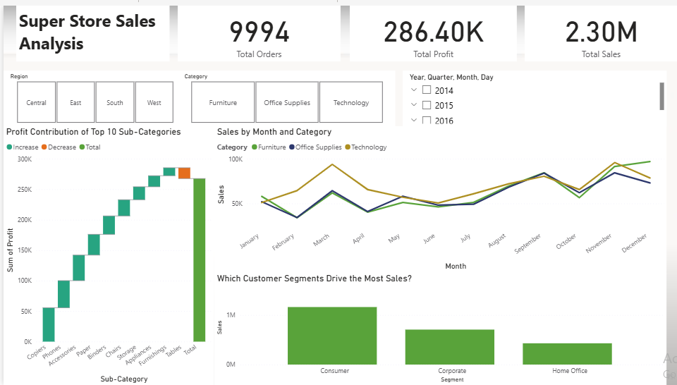

# powerbi-superstore-dashboard
Power BI dashboard project analyzing Superstore sales data by category, segment, and region.
# 📊 SuperStore Sales Dashboard – Power BI Project

## 🚀 Objective
Create an interactive Power BI dashboard to analyze sales, profit, and customer segments for a fictional SuperStore. The goal was to extract actionable insights using data visualization.

## 📈 Key Insights
- Technology is the top-performing category with highest sales and profit.
- Consumer segment brings in the largest revenue.
- Certain sub-categories have consistent losses over time.
- Monthly sales trend shows seasonal peaks and overall growth.
- Profitability varies by region and product type.

## 📂 Features
- KPI cards (Total Sales, Profit, Orders)
- Dynamic slicers for Region, Category, and Year
- Waterfall chart showing top 10 sub-categories by profit
- Monthly sales trend line by Category
- Bar chart comparing sales by Customer Segment
## 🛠 Tools Used
- Power BI Desktop
- DAX (basic calculated measures)
- Kaggle SuperStore dataset
## 📁 Download the Dashboard
- [Download PBIX File](./super-store-sales-analysis.pbix)

## 🖼 Screenshot

